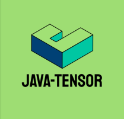

<p align="center">
  
</p>

<h1 align="center">java-tensor</h1>

<p align="center">
  A compact, generic tensor library for Java 11 with multidimensional indexing,
  views, broadcasting, reductions, and binary serialization.
</p>

## Overview

`JTensor<T>` stores values in row-major order and provides familiar tensor
operations without requiring a native runtime. It supports:

- reshaping, transposing, slicing, reversing, and dimension swapping;
- element-wise arithmetic, comparison, and boolean operations;
- NumPy-style broadcasting;
- reductions such as `sum`, `product`, `min`, `max`, `mean`, `var`,
  `std`, `all`, and `any`;
- masking, concatenation, mapping, filtering, and type conversion;
- serialization for booleans and Java numeric wrapper types.

The implementation is intentionally small: tensors are backed by ordinary Java
arrays, while views keep a logical index mapping into their source storage.

## Requirements

- Java 11 or newer
- Maven 3

## Build

```bash
git clone https://github.com/TalalAlrawajfeh/java-tensor.git
cd java-tensor
mvn clean test
```

To install the current snapshot in your local Maven repository:

```bash
mvn install
```

```xml
<dependency>
    <groupId>com.tensor</groupId>
    <artifactId>java-tensor</artifactId>
    <version>1.0-SNAPSHOT</version>
</dependency>
```

## Quick start

```java
import com.tensor.JTensor;
import java.util.Arrays;

Integer[][] values = {
    {1, 2, 3},
    {4, 5, 6}
};

JTensor<Integer> tensor = JTensor.from2DArray(Integer.class, values);

System.out.println(Arrays.toString(tensor.getShape())); // [2, 3]
System.out.println(tensor.getItem(new int[]{1, 2}));    // 6
System.out.println(tensor.transpose());
```

### Creating tensors

```java
JTensor<Double> zeros = JTensor.zeros(Double.class, new int[]{2, 3});
JTensor<Integer> ones = JTensor.ones(Integer.class, new int[]{2, 3});

JTensor<Integer> initialized = new JTensor<>(
    Integer.class,
    new int[]{2, 3},
    indices -> indices[0] * 10 + indices[1]
);

JTensor<Integer> repeated = JTensor.repeat(
    Integer.class,
    new int[]{2, 3},
    7
);
```

The shape must contain positive dimensions. Scalar tensors are not part of the
current API; reductions that remove the final axis return a one-element tensor.

### Indexing and mutation

```java
JTensor<Integer> tensor = JTensor.from2DArray(Integer.class, new Integer[][]{
    {1, 2, 3},
    {4, 5, 6}
});

int value = tensor.getItem(new int[]{1, 0}); // 4
tensor.setItem(new int[]{0, 2}, 99);
```

Scalar indexing requires exactly one index per tensor dimension. Too few, too
many, or out-of-range indices fail with a clear argument or bounds exception.

### Views and logical order

Operations such as `transpose()`, `slice()`, `reverse()`, and
`swapDimensions()` can produce views. A view may share storage with its source
while presenting a different logical order:

```java
JTensor<Integer> matrix = JTensor.from2DArray(Integer.class, new Integer[][]{
    {1, 2, 3},
    {4, 5, 6}
});

JTensor<Integer> transposed = matrix.transpose();
JTensor<Integer> flattened = transposed.reshape(new int[]{6});

System.out.println(flattened); // [1, 4, 2, 5, 3, 6]
```

Reshaping a non-contiguous view materializes its values in logical row-major
order. It never reinterprets the original backing array in an order that would
change the tensor's values.

```java
JTensor<Integer> view = matrix.transpose();
JTensor<Integer> copy = new JTensor<>(view);

view.setItem(new int[]{0, 0}, 100); // also changes matrix
copy.setItem(new int[]{0, 0}, 200); // does not change view or matrix
```

The copy constructor always creates independent, contiguous storage. It copies
the logical values of a view rather than its old backing-array layout.

### Slicing

Each slice is written as `{start, end}`, with an exclusive end:

```java
JTensor<Integer> tensor = new JTensor<>(
    Integer.class,
    new int[]{4, 5},
    indices -> indices[0] * 5 + indices[1]
);

JTensor<Integer> middle = tensor.slice(new int[][]{
    {1, 3},
    {2, 5}
});
```

### Broadcasting

```java
JTensor<Integer> matrix = JTensor.ones(Integer.class, new int[]{3, 4});
JTensor<Integer> row = JTensor.repeat(Integer.class, new int[]{4}, 2);

JTensor<Integer> result = JTensor.multiply(matrix, row);
```

Dimensions are compatible when they are equal or one of them is `1`.

### Reductions

```java
JTensor<Integer> tensor = JTensor.from2DArray(Integer.class, new Integer[][]{
    {1, 2, 3},
    {4, 5, 6}
});

JTensor<Integer> columnSums = JTensor.sum(tensor, 0, false); // [5, 7, 9]
JTensor<Integer> rowMaxima = JTensor.max(tensor, 1, false);  // [3, 6]
```

## Copying, flattening, and data access

These methods have deliberately different ownership semantics:

| Operation | Result |
| --- | --- |
| `new JTensor<>(tensor)` | Independent contiguous copy |
| `flatten()` | Independent one-dimensional copy |
| `ravel()` | Reshape semantics: may share contiguous base storage; materializes views |
| `getShape()` | Defensive copy |
| `getStrides()` | Defensive copy |
| `getData()` | Raw mutable backing array |

`getData()` is the low-level escape hatch. Mutating it changes the tensor, and
for a view its physical array order may differ from the view's logical order.
Prefer indexed operations unless direct backing-array access is intentional.

## Serialization

```java
byte[] encoded = tensor.toByteArray();
JTensor<?> decoded = JTensor.fromByteArray(encoded);
```

Binary serialization supports `Boolean`, `Byte`, `Short`, `Integer`,
`Long`, `Float`, and `Double`. Views are serialized in logical order and
deserialize as contiguous tensors. Null elements cannot be serialized.

## Supported element types

Arithmetic operations support:

- `Byte`
- `Short`
- `Integer`
- `Long`
- `Float`
- `Double`

Boolean tensors are supported by boolean operations and serialization. Generic
construction and indexing can use other reference types where an operation does
not require numeric behavior.

## Tests

```bash
mvn clean test
```

The regression suite covers contiguous tensors, transposed and sliced views,
reshape ordering, copy independence, broadcasting, reductions, serialization,
rank validation, null-safe equality, and randomized view/index properties.

## License

This project is available under the terms in [LICENSE](LICENSE).
